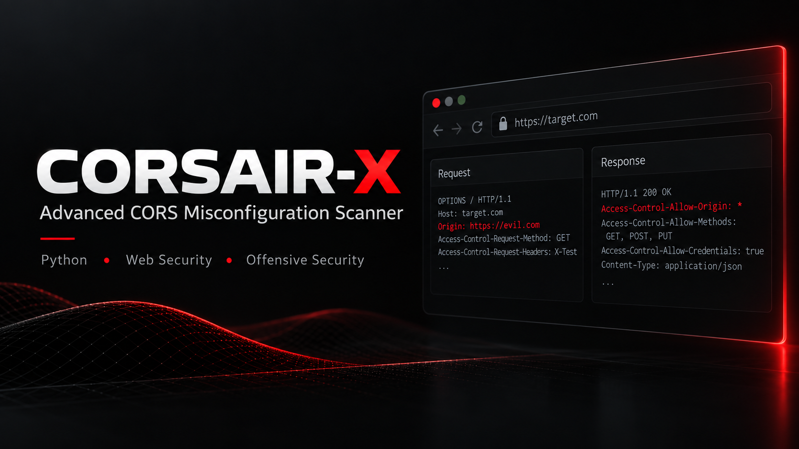

<p align="center">
  
</p>

# CORSAIR-X | Advanced CORS Misconfiguration Scanner


**CORSAIR-X** is a blazing fast, asynchronous, and intelligent tool designed to discover Cross-Origin Resource Sharing (CORS) misconfigurations in web applications. It leverages `aiohttp` for high-concurrency scanning and includes an internal crawler to discover endpoints automatically.

## 🚀 Features

* **⚡ Asynchronous & Fast:** Built on `asyncio` and `aiohttp` to scan thousands of endpoints in seconds.
* **🕷️ Internal Crawler:** Automatically scrapes the target website for links (JS, forms, anchors) to expand the attack surface.
* **🧠 Smart Protocol Resolution:** Automatically detects if a target is running on HTTP, HTTPS, or both.
* **🛠️ Advanced Header Support:** Send multiple custom headers (Cookies, Auth tokens) separated by semicolons (e.g., `-H "Cookie: A=B; Auth: Bearer X"`).
* **🛡️ Comprehensive Checks:**
    * Reflected Origin checks.
    * `null` Origin checks.
    * Wildcard `*` checks.
    * Trusted domain list bypasses.
* **📝 Detailed Reporting:**
    * Captures **ACAO** (Access-Control-Allow-Origin).
    * Captures **ACAC** (Access-Control-Allow-Credentials).
    * Captures **ACAH** (Access-Control-Allow-Headers) [New].
* **🕵️ Proxy Support:** Supports single proxies or rotating proxies from a file.
* **🔇 Silent Mode:** Perfect for piping output to other tools.

## 📦 Installation

1.  Clone the repository:
    ```bash
    git clone https://github.com/ghoxtbyte/corsair-x.git
    cd corsair-x
    ```

2.  Install dependencies:
    ```bash
    pip install -r requirements.txt
    ```

## 💻 Usage

```bash
python corsairx.py [options]
```

## ⚙️ Arguments

| Argument | Description |
|--------|-------------|
| `-u, --url` | Single target URL (e.g., `example.com`). |
| `-l, --list` | File containing a list of URLs to scan. |
| `--crawl` | Enable the internal crawler to find more endpoints. |
| `--acah` | Include vulnerability even if Access-Control-Allow-Headers is present (Default: Skip) |
| `-H, --custom-header` | Custom headers. Use `;` to separate multiple headers. |
| `--origins` | Custom payload/origins file (or single string). |
| `-o, --output` | Save vulnerable URLs to a file. |
| `-oC, --output-crawl` | Save crawled endpoints to a file. |
| `-p, --proxy` | Single proxy URL (e.g., `http://127.0.0.1:8080`). |
| `-pf, --proxy-file` | File containing a list of proxies for rotation. |
| `--timeout` | Request timeout in seconds (Default: 10). |
| `--concurrency` | Number of concurrent requests (Default: 20). |
| `-v, --verbose` | Show progress bar even in silent mode. |
| `--debug` | Enable deep debugging output. |

## 💡 Examples
**1. Basic Scan of a Single Domain:**
```bash
python corsairx.py -u https://example.com
```
**2. Crawl and Scan (Recommended):** This will first crawl example.com for links and then scan all found endpoints.
```bash
python corsairx.py -u https://example.com --crawl
```
**3. Using Custom Headers (Cookies/Auth):** Note: You can pass multiple headers in one string separated by a semicolon `;`.
```bash
python corsairx.py -u https://api.example.com -H "Cookie: session=12345; Authorization: Bearer XYZ"
```
**4. Scanning a List of Domains with Output:**
```bash
python corsairx.py -l targets.txt -o vulnerable.txt --concurrency 50
```
**5. Using Proxy (e.g., Burp Suite):**
```bash
python corsairx.py -u https://example.com -p http://127.0.0.1:8080
```

## 📊 Output Format
When a vulnerability is found, CORSAIR-X reports:
```bash
[+] VULNERABILITY FOUND!
URL: https://api.example.com/data
Origin Used: https://evil.com
Method: GET
ACAO: https://evil.com
ACAC: true
ACAH: X-Requested-With, Content-Type  <-- (New Feature)
```

## License
This project is licensed under the MIT License - see the [LICENSE](LICENSE) file for details.
